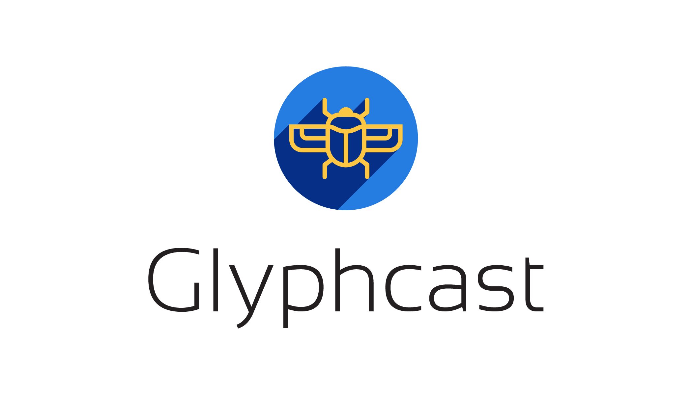

<p align="center"></p>

Glyphcast is an HTTP API that transforms your DOCX and SVG files into beautiful PDFs. Harnessing the power of [CairoSVG](https://cairosvg.org/) and [unoconv](https://github.com/unoconv/unoconv),  Glyphcast is optimized for blazing-fast in-memory conversion of small files (think <100mb).

See [client.py](https://github.com/team-sparkfish/svg-to-pdf-service/blob/dev/client.py) for example client usage, or see the examples using [HTTPie](https://httpie.org/) and [cURL](https://curl.haxx.se/) below.

**HTTPie**

``` shell
http -d GET http://localhost:5000/convert?from=svg&to=pdf @sparkfish.svg --output sparkfish.pdf
```

**cURL**

``` shell
curl -vX GET http://localhost:5000/convert?from=svg&to=pdf -d @sparkfish.svg --header "Content-Type: application/text" > sparkfish.pdf
```

## Development

Copy `example.env` to `.env` and ensure that the environment variables are properly set (the parameters are thoroughly documented in the `.env` file comments).

Then, to install dependencies, `pip install -r requirements.txt` and simply do `python main.py` to start the server.

In production you'll want to use a production grade server such as [gunicorn](https://gunicorn.org/):

`gunicorn --workers=4 main:app`

## Docker image

To build the Dockerfile, do `docker build . -t glyphcast`, and then `docker run -p 5000:5000`. This will start a container with the app running behind a gunicorn server listening on port 5000.

## Caveats and Roadmap

### tmpfs storage

Presently Glyphcast uses `/dev/shm` to store intermediate files during document conversion in volatile memory (in `/dev/shm/glyphcast`). Intermediate files are unlinked immediately after conversion. Note that different Linux distributions have different default size limits on `/dev/shm`, but it tends to be about half the memory on the system. Check the amount available on your distribution of choice with `df -h /dev/shm`. Resizing can be done with e.g. `mount -o remount,size=16G /dev/shm` (the previous command remounts `/dev/shm` with 16GB). Further there are no guarantees that data written to `/dev/shm` will not be written to disk in a system under heavy load. Future versions of Glyphcast will create and mount a dedicated `tmpfs` filesystem with configurable sizing.

### Scalability

At the moment, Glyphcast handles requests sequentially, meaning it is unsuitable for heavy load. We intend to support a pub/sub architecture in the future for better scalability.
